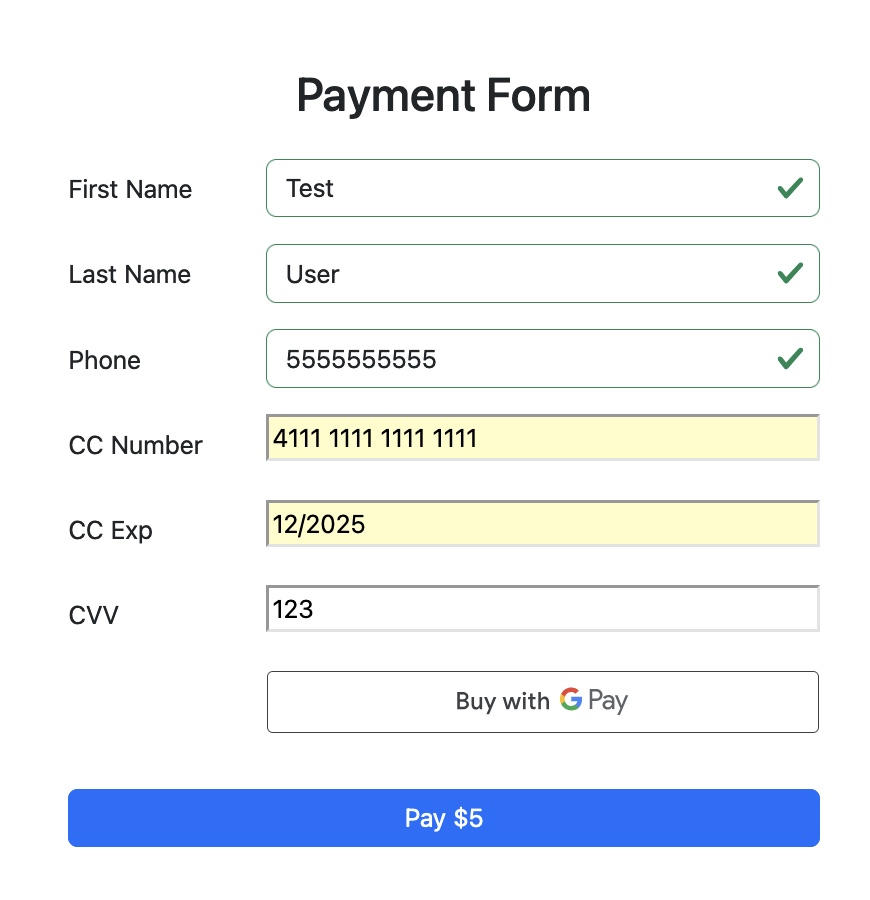

# Seamlesschex Transaction Gateway

A simple Node.js and Express app integrated with Seamlesschex Transaction Gateway, using Bootstrap for front-end styling and environment variables for secure configuration.



## Features
- **Node.js**: Backend functionality
- **Express**: Lightweight web application framework
- **Bootstrap**: Responsive front-end design
- **Environment Variables**: Secure management of sensitive keys
- **Data Tokenization**: Secure data handling with `data_tokenization_key`
- **Direct Post**: API integration using `DirectPost_key`

## Prerequisites

Make sure you have the following installed:
- [Node.js](https://nodejs.org/) (v14 or later)
- npm (comes with Node.js)

## Installation

1. **Clone the Repository**:
   ```bash
   git clone https://github.com/yourusername/seamlesschex-transaction-gateway.git
   cd seamlesschex-transaction-gateway
   ```

2. **Install Dependencies**:
   ```bash
   npm install
   ```

3. **Setup Environment Variables**:
   Create a `.env` file in the root of the project and add the following:
   ```env
   data_tokenization_key=your_tokenization_key_here
   DirectPost_key=your_directpost_key_here
   ```

4. **Start the App**:
   ```bash
   npm start
   ```
   By default, the app runs on `http://localhost:3000`.

## Folder Structure
```
.
├── public/              # Static files (CSS, JS, images)
├── views/               # Front-end views (HTML/Handlebars)
├── routes/              # Express routes
├── .env                 # Environment variables
├── app.js               # Main entry point
└── package.json         # Project metadata and dependencies
```

## Usage
1. Navigate to `http://localhost:3000` in your browser.
2. Use the provided form to submit transactions securely through Seamlesschex.
3. Logs or responses will be displayed in the console or handled on the front-end.

## Built With
- [Node.js](https://nodejs.org/)
- [Express.js](https://expressjs.com/)
- [Bootstrap](https://getbootstrap.com/)
- [dotenv](https://github.com/motdotla/dotenv)

## Environment Variables
| Variable              | Description                     |
|-----------------------|---------------------------------|
| `data_tokenization_key` | Used for secure tokenization    |
| `DirectPost_key`       | Seamlesschex DirectPost key    |

## License
This project is licensed under the MIT License.
